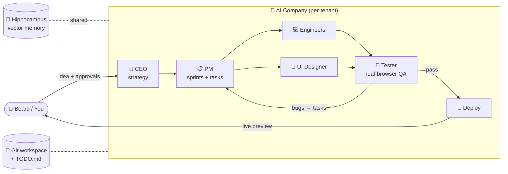
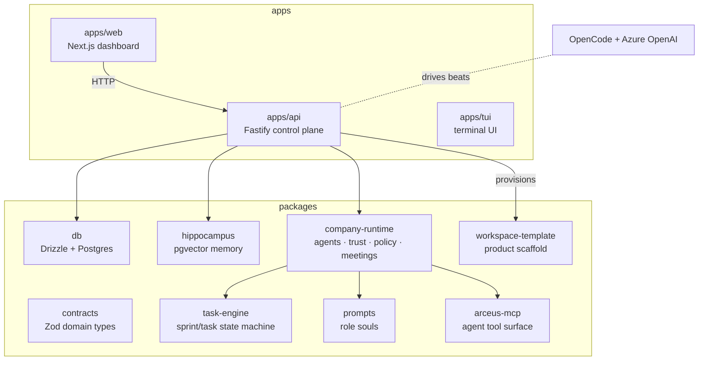

<div align="center">

# ⚔️ Arceus

### Your AI company, running autonomously.

Arceus is an **operating system for an AI-run software company**. You act as the board of directors — you hand down an idea, and a team of LLM agents (CEO, PM, designers, engineers, QA) plans sprints, writes code in an isolated workspace, runs QA in a real browser, and ships. You govern; they build.

[](LICENSE)
[](https://github.com/divo12/Arceus/actions/workflows/ci.yml)
[](https://www.typescriptlang.org/)
[](https://github.com/sst/opencode)
[](https://nodejs.org/)

[Quickstart](#-quickstart) · [How it works](#-how-it-works) · [Architecture](#-architecture) · [Deployment](#-deployment) · [Contributing](CONTRIBUTING.md)

</div>

---

## 🧠 What is Arceus?

Most "AI coding agents" are a single assistant in your editor. **Arceus is the whole company.**

You give it a product direction — *"a lightweight B2B tool for finance teams to track renewal risk"* — and Arceus boots a persistent, multi-agent organization that runs on its own clock:

- The **CEO** turns your idea into a strategy and briefs the team.
- The **PM** breaks strategy into sprints and tasks.
- **Engineers**, a **UI designer**, and a **CTO** build the actual product in a git-tracked, previewable workspace.
- A **tester** drives the running product in a real browser and files bugs back as tasks.
- Every agent shares long-term **vector memory** and a durable per-workspace checklist so work survives across turns.

You stay in the loop as the board: set direction, approve decisions, watch the product take shape in a live preview — and step away while it keeps working.

> Arceus is built on top of [OpenCode](https://github.com/sst/opencode) as its agent runtime and speaks to any Azure OpenAI deployment.

---

## ⚙️ How it works

Arceus runs a **heartbeat**. On each tick, any role with claimable work gets a **beat** — one autonomous agent turn inside the company's isolated workspace, driven by OpenCode with a curated set of MCP tools.



**The beat loop, concretely:**

1. **Heartbeat** ticks → the orchestrator picks roles with claimable work.
2. Each role gets a **beat briefing**: company state, its open tasks, recent artifacts, shared memory, and the workspace `TODO.md` (its durable resume point).
3. The agent works via **MCP tools** — claim a task, edit files, run the preview, check off `TODO.md`, hand off, or block.
4. Results persist to Postgres; the product lives in a **per-company git workspace**; long-term learnings go to **Hippocampus** (pgvector).
5. Repeat — sprint after sprint — until the product ships, with you approving the decisions that matter.

---

## 👥 The team

Each employee is a `mode: primary` OpenCode agent with its own soul (system prompt), tools, and responsibilities.

| Role | Responsibility |
|------|----------------|
| 🧭 **CEO** | Turns the board's idea into strategy; owns direction and high-stakes decisions. |
| 📋 **PM** | Plans sprints, decomposes strategy into tasks, sequences the backlog. |
| 🏗️ **CTO** | Technical direction, architecture calls, specs-only oversight. |
| 💻 **Developer** | Writes the full-stack product code in the workspace. |
| 🎨 **UI Designer** | Builds the interface against a world-class design system. |
| 🧪 **Tester** | Drives the running product in a real browser; files bugs as tasks. |
| 📣 **Marketing** | Positioning, launch and go-to-market narrative. |
| 🧩 **Skills Lead** | Curates and evolves the reusable skill library agents draw on. |

---

## ✨ Features

- **Autonomous multi-agent org** — a persistent company that plans, builds, tests, and ships on its own heartbeat.
- **Isolated per-company workspaces** — every company builds its product in its own git repo (Vite + React + Hono + SQLite scaffold), fully previewable.
- **Real-browser QA** — the tester service drives the live product like a user and turns failures into fix tasks.
- **Long-term memory** — Hippocampus (pgvector) gives agents recall across beats and sprints, with hybrid keyword+vector retrieval.
- **Durable resume** — a per-workspace `TODO.md` checklist means work continues cleanly across turns and restarts.
- **Governance built in** — trust scores, policy checks, and human approval gates keep the board in control.
- **Observability** — OpenTelemetry tracing plus a live inspector event stream for every beat and tool call.
- **Secure by default** — admin-token auth on mutating routes, CORS allow-lists, per-company env isolation, and secret scanning in CI.

---

## 🏛 Architecture

A TypeScript monorepo (`apps/*` + `packages/*`) orchestrated with npm workspaces.



| Workspace | What it does |
|-----------|--------------|
| `apps/api` | Fastify control-plane API — heartbeat, orchestration, routes, MCP surface. |
| `apps/web` | Next.js board dashboard — chat with the CEO, watch sprints, preview the product. |
| `apps/tui` | Terminal UI client. |
| `packages/contracts` | Shared domain types + Zod schemas (the single source of truth for shapes). |
| `packages/db` | Drizzle ORM schema + Postgres adapter + migrations. |
| `packages/hippocampus` | Vector memory engine (pgvector, hybrid retrieval, in-memory fallback). |
| `packages/company-runtime` | Agent definitions, trust, policy, skills, meetings. |
| `packages/task-engine` | Sprint/task state machine and execution cycle. |
| `packages/prompts` | Role "souls" — the system prompts for each employee. |
| `packages/arceus-mcp` | The MCP tools agents call (tasks, workspace, todo, previews…). |
| `packages/workspace-template` | The canonical product scaffold copied into each new company. |
| `services/flow-tester` | Standalone browser-agent QA service. |

---

## 🚀 Quickstart

### Prerequisites

- **Node.js ≥ 22.12** and **npm ≥ 9**
- **PostgreSQL 16+ with the `pgvector` extension** (for persistence + memory; Arceus falls back to in-memory without it, but a DB is required for real use)
- An **Azure OpenAI** resource with a chat deployment (the LLM backend)
- Optional: [`bun`](https://bun.sh) (used by a few scripts + tests) and [`gitleaks`](https://github.com/gitleaks/gitleaks) (pre-commit secret scan)

### 1. Clone & install

```bash
git clone https://github.com/divo12/Arceus.git
cd Arceus
npm install
```

### 2. Configure

```bash
cp .env.example .env.local
# then fill in the required values (see Configuration below)
```

At minimum set your **Azure OpenAI** credentials and a **Postgres** URL.

### 3. Set up the database

```bash
npm run db:generate   # generate migrations from the Drizzle schema
npm run db:migrate    # apply them
```

### 4. Run

```bash
npm run dev           # API (:4000) + web dashboard (:3000) together
# or individually:
npm run dev:api
npm run dev:web
```

Open **http://localhost:3000**, tell the CEO what to build, and watch the company get to work.

---

## 🔧 Configuration

Environment lives in `.env.local` (see [`.env.example`](.env.example) for the full annotated list). The essentials:

| Variable | Required | Purpose |
|----------|:--------:|---------|
| `ARCEUS_AZURE_OPENAI_ENDPOINT` | ✅ | Azure OpenAI endpoint (`*.cognitiveservices.azure.com`). |
| `ARCEUS_AZURE_OPENAI_API_KEY` | ✅ | Azure OpenAI key. |
| `ARCEUS_AZURE_OPENAI_DEPLOYMENT` | ✅ | Chat deployment name used for agent beats. |
| `SUPABASE_DB_URL` / `DATABASE_URL` | ▲ | Postgres connection string (pgvector). In-memory without it. |
| `ARCEUS_JWT_SECRET` | ▲ prod | Session-token signing secret (≥ 32 chars). Required in production. |
| `ARCEUS_ADMIN_TOKEN` | ▲ prod | Bearer token gating mutating `/api/*` routes (≥ 16 chars). |
| `ARCEUS_REQUIRE_AUTH` | – | Force the admin auth gate on/off regardless of `NODE_ENV`. |
| `ARCEUS_ALLOWED_ORIGINS` | ▲ prod | CORS allow-list for browser clients. |
| `ARCEUS_WORKSPACE_ROOT` | – | Where per-company workspaces live on disk. |

> **Security:** never commit real secrets. `.env*` is gitignored, a pre-commit **gitleaks** hook scans staged changes, and CI runs a full gitleaks pass. In production the server fails loudly if `ARCEUS_JWT_SECRET` / `ARCEUS_ADMIN_TOKEN` are missing.

---

## 🧱 Project structure

```
Arceus/
├── apps/
│   ├── api/      # Fastify control-plane API (heartbeat, orchestration, MCP)
│   ├── web/      # Next.js board dashboard
│   └── tui/      # terminal UI
├── packages/
│   ├── contracts/          # Zod domain types
│   ├── db/                 # Drizzle schema + migrations
│   ├── hippocampus/        # pgvector memory engine
│   ├── company-runtime/    # agents, trust, policy, meetings
│   ├── task-engine/        # sprint/task state machine
│   ├── prompts/            # role souls
│   ├── arceus-mcp/         # agent tool surface (MCP)
│   └── workspace-template/ # per-company product scaffold
├── services/
│   └── flow-tester/        # browser-agent QA service
├── docs/                   # VitePress + TypeDoc reference
├── plans/                  # design specs & architecture notes
└── scripts/                # dev/ops tooling
```

---

## 🛠 Tech stack

- **Runtime:** [OpenCode](https://github.com/sst/opencode) agents on **Azure OpenAI**
- **API:** Fastify · TypeScript (run via `tsx`) · Zod · OpenTelemetry
- **Web:** Next.js · React · Tailwind · React Flow (`@xyflow/react`)
- **Data:** PostgreSQL · Drizzle ORM · `pgvector`
- **Product scaffold** (what companies build): Vite · React · Hono · `node:sqlite`
- **Tooling:** npm workspaces · ESLint · Husky · gitleaks · bun (scripts/tests) · Docker

---

## 🚢 Deployment

Arceus deploys as **one Railway project** (API + Postgres) plus the **web app on Vercel**. The full, step-by-step guide — services, volumes, env vars, and gotchas — is in **[DEPLOY.md](DEPLOY.md)**.

```
Vercel (apps/web)  ──HTTPS──▶  Railway: api (Docker)  ◀──▶  Railway: Postgres + pgvector
```

---

## 🧪 Development

```bash
npm run dev            # run API + web together
npm run typecheck      # tsc --noEmit across all workspaces
npm run lint           # ESLint (incl. no-silent-catch safety rules)
npm run build          # build all workspaces
npm run docs:dev       # VitePress + TypeDoc docs site
```

A pre-commit hook runs lint-staged, gitleaks, silent-catch lint, a full typecheck, and the schema-drift test. CI mirrors these plus migration linting and a full secret scan.

---

## 🤝 Contributing

Contributions are welcome — see **[CONTRIBUTING.md](CONTRIBUTING.md)** for the dev setup, workflow, coding standards, and PR checklist.

## 📄 License

[MIT](LICENSE) © Arceus

## 🙏 Acknowledgements

Built on the shoulders of [OpenCode](https://github.com/sst/opencode), Fastify, Drizzle, and pgvector.
