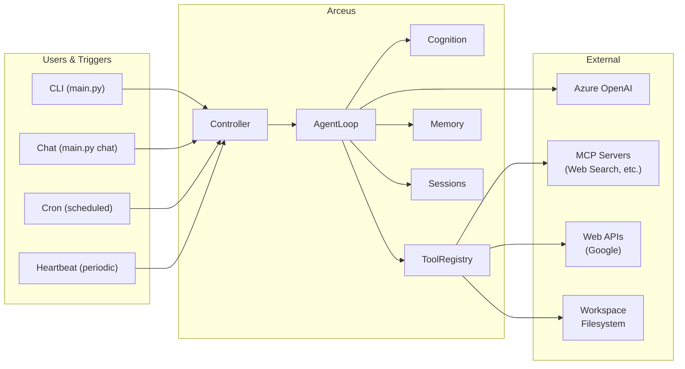
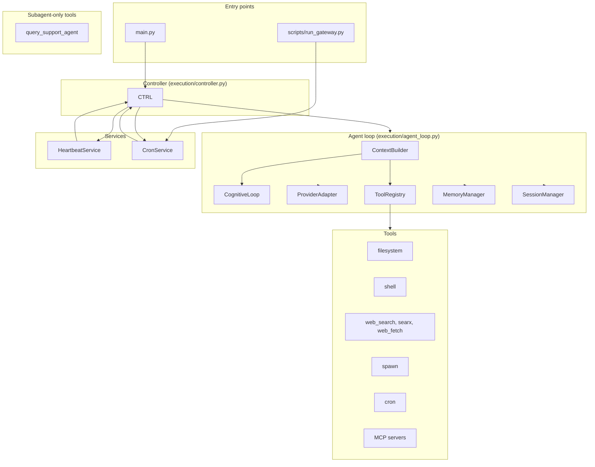
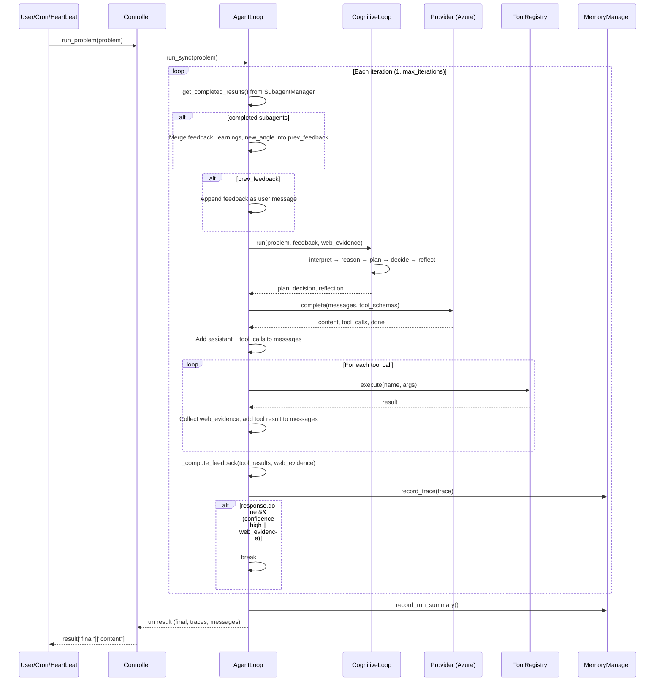

# Arceus Architecture

High-level architecture of the Arceus PM agent: a nanobot-inspired, product-management-focused autonomous system.

---

## 1. System Context



**Inbound:** User (CLI/chat), cron jobs (`.arceus/cron.json`), heartbeat (HEARTBEAT.md).  
**Outbound:** Azure OpenAI (LLM), MCP servers (e.g. Web Search), web APIs, workspace files.

---

## 2. Overview

Arceus is an **iterative PM agent** that, given a problem, thinks about what to build, gathers feedback (tools, web, subagents), and refines its plan. It has **no channel integrations** (no Discord/Slack); it runs via CLI, gateway (heartbeat + cron), or single-problem invocation.

**Core properties:**

- **ReACT-style loop**: context → cognition → provider → tools → feedback → iterate
- **PM cognition**: interpret → reason → plan → decide → reflect (with optional web evidence and subagent results)
- **Three-tier skills**: Essential (survival), Workspace (PM), Open (tool-level)
- **Feedback construct**: tool outputs and subagent results are summarized and fed into the next iteration
- **Subagents**: main agent can spawn focused subagents (validation, research) via `spawn` tool; subagents run in the background; their feedback, learnings, and new angles are integrated at the start of the next iteration
- **Gateway**: heartbeat (periodic HEARTBEAT.md tasks) + cron (scheduled jobs) for 24/7 operation

---

## 3. High-Level Architecture



**Data flow (single run):**

1. **Controller** receives a problem (user, heartbeat, or cron job).
2. **AgentLoop** builds context (ContextBuilder + SkillsLoader), runs **CognitiveLoop** (plan/decision/reflection).
3. **Provider** (Azure OpenAI) returns content and optional tool calls.
4. **ToolRegistry** executes tools (filesystem, web, spawn, cron, MCP); **feedback** is computed from tool results and completed subagent results (feedback, learnings, new_angle).
5. Next iteration: feedback is injected as a user message; cognition and provider run again.
6. **MemoryManager** records traces and run summaries; **SessionManager** persists chat history when `session_key` is set.
7. Loop exits when provider sets `done` and (if required) web evidence exists or confidence is high.

---

## 4. Request Flow (Single Problem)



---

## 5. Repository Layout

```
Arceus/
├── main.py                    # Entry: gateway, chat, status, onboard, single problem
├── settings.py                # Env-loaded settings (Azure, cronitor, DB, etc.)
│
├── agents/                    # Agent identity, context, skills, tools
│   ├── agent.py                # Agent: spawned subagent class (feedback, learnings, new_angle)
│   ├── context_builder.py     # System prompt: identity, bootstrap, memory, skills
│   ├── skills.py              # SkillsLoader: essential / workspace / open
│   ├── memory.py              # MemoryStore: MEMORY.md + HISTORY.md
│   └── tools/                 # All callable tools
│       ├── registry.py        # ToolRegistry
│       ├── base.py            # Base tool + schema validation
│       ├── filesystem.py      # read_file, write_file, edit_file, list_dir
│       ├── shell.py           # exec
│       ├── web.py             # web_search, web_fetch
│       ├── spawn.py           # spawn (subagent)
│       ├── support_query.py   # query_support_agent (workspace PM context)
│       ├── cron.py            # cron add/list/remove (when skill enabled)
│       ├── mcp.py             # MCP client + connect_mcp_servers, schema sanitization
│       └── message.py         # (optional) message formatting
│
├── cognition/                 # Think–plan–decide–reflect
│   ├── cognitive_loop.py     # interpret → reason → plan → decide → reflect
│   ├── decision_policy.py    # confidence, requires_web_evidence
│   ├── planner.py            # Plan with phases, skills, prompts
│   ├── reasoner.py            # Reasoning + risks
│   ├── state_interpreter.py  # Objectives, constraints from problem
│   └── memory/
│       ├── memory_manager.py # Coordinates short/long term
│       ├── short_term_memory.py
│       └── long_term_memory.py  # data/state/cognitive_memory.json
│
├── execution/                 # Runtime
│   ├── agent_loop.py         # Core loop: context → provider → tools → feedback
│   ├── controller.py         # Controller: AgentLoop + Heartbeat + Cron
│   ├── subagent_manager.py   # SubagentManager: background spawn, queues feedback/learnings/new_angle
│   └── executor.py           # (optional) action execution helpers
│
├── providers/                 # LLM
│   ├── adapter.py            # ProviderAdapter, ProviderResponse, ToolCall
│   └── azure_openai_provider.py  # Azure OpenAI implementation
│
├── config/                    # Configuration
│   ├── loader.py             # load_config, find_config_path
│   └── schema.py             # Config, agents, providers, tools, mcp_servers
│
├── session/                   # Conversation sessions
│   └── manager.py            # SessionManager, sessions in workspace/sessions/
│
├── cron/                      # Scheduled jobs
│   ├── service.py            # CronService, .arceus/cron.json
│   ├── types.py              # CronJob, CronSchedule, CronPayload
│   └── cronitor_ping.py       # Cronitor integration
│
├── heartbeat/                 # Periodic wake-up
│   └── service.py            # HeartbeatService, HEARTBEAT.md
│
├── pm_ideas/                  # PM ideas sweep (cron-driven)
│   └── service.py            # run_ideas_sweep_with_loop, PM_IDEAS.md
│
├── observability/
│   └── logger.py             # configure_logging, .arceus/logs/arceus.log
│
├── models/                    # Prompts and types
│   ├── provider_types.py
│   └── prompts/
│       └── task_prompts/     # PM prompt templates
│
├── skills/                    # Three-tier skills (on disk)
│   ├── essential/             # Always loaded (heartbeat, memory, web-search)
│   ├── workspace_skills/      # PM designation skills
│   │   └── _drafts/          # Draft skills (review gate)
│   └── open_skills/          # Tool-level (web-search-api, etc.)
│
├── skill-creator/             # Skill creation support
│   ├── creator/
│   ├── research/
│   └── scripts/
│
├── data/state/                # Persistent state
│   └── cognitive_memory.json # Long-term memory (episodes, traces, runs, facts)
│
├── .arceus/                   # Workspace runtime (created at run)
│   ├── config.json           # User config (overrides defaults)
│   ├── cron.json             # Cron jobs
│   ├── logs/
│   │   └── arceus.log
│   └── history/              # CLI history (prompt_toolkit)
│
├── scripts/
│   └── run_gateway.py        # Cron job CLI: add/list/remove/run, ideas
│
├── examples/                  # Test/demo scripts
│   ├── test_web_search_mcp.py
│   ├── test_spawn_feedback.py
│   └── try_web_scraping.py
│
├── tests/
└── docs/
    ├── architecture.md       # This file
    ├── usage.md
    ├── web_search_mcp.md
    ├── spawn_feedback.md
    └── pm_ideas.md
```

---

## 6. Entry Points

| Entry | Purpose |
|-------|--------|
| `uv run python main.py` | Start gateway (heartbeat + cron). |
| `uv run python main.py "problem"` | Single problem run; print final content. |
| `uv run python main.py chat` | Interactive chat (Rich Markdown, streaming, session). |
| `uv run python main.py status` | Print config path, provider, cron count, sessions. |
| `uv run python main.py onboard` | Create `.arceus/config.json`, `sessions/`, `skills/workspace_skills/`, `HEARTBEAT.md`. |
| `uv run python main.py --no-cron` | Gateway without cron. |
| `uv run python scripts/run_gateway.py add --ideas --cron "0 9 * * *"` | Add PM ideas job. |
| `uv run python scripts/run_gateway.py ideas` | Run PM ideas sweep once. |
| `uv run python scripts/run_gateway.py run` | Run gateway (same idea as main.py). |

---

## 7. Core Runtime: Agent Loop

**File:** `execution/agent_loop.py`

**Responsibilities:**

- Load config (or use defaults), build **ContextBuilder**, **SkillsLoader**, **CognitiveLoop**, **MemoryManager**, **SessionManager**, **ToolRegistry**, **SubagentManager**, **Provider** (Azure OpenAI).
- For each run: connect MCP servers from config (e.g. Web Search MCP), build messages (context + optional feedback from previous iteration).
- Per iteration:
  1. Optionally append **feedback message** (from previous tool run).
  2. Run **CognitiveLoop** (interpret → reason → plan → decide → reflect); inject `feedback` into reflection.
  3. Call **provider.complete()** with messages and tool schemas.
  4. Execute tool calls via **ToolRegistry**; collect **web evidence** from `web_search` / `web_fetch` / `mcp_web_search_*`.
  5. **Compute feedback** (tool summaries + subagent results); set `prev_feedback` for next iteration.
  6. Record **trace** and **memory**; if `session_key`, append to session.
- Disconnect MCP tools at end of run; return run summary, messages, traces, web_evidence, drafted_skills.

**Feedback construct:**  
`_compute_feedback()` builds a short summary from tool results and subagent outputs; `_format_feedback_message()` turns it into a user message so the next iteration can refine the plan.

---

## 8. Cognition Pipeline

**File:** `cognition/cognitive_loop.py`

**Flow:** `interpret` → `reason` → `plan` → `decide` → `reflect`

| Step | Module | Role |
|------|--------|------|
| Interpret | StateInterpreter | Problem + context → objectives, constraints. |
| Reason | Reasoner | Reasoning + risks. |
| Plan | Planner | Phases, skills_to_use. |
| Decide | DecisionPolicy | next_actions, confidence, requires_web_evidence. |
| Reflect | CognitiveLoop._reflect | learning, subagent_count, web_evidence_count, next_iteration_focus. |

**Feedback:** If `feedback` is passed in, its `summary` and `subagent_results` are merged into `action_result` and used in reflection. Episodes are stored via **MemoryManager**.

---

## 9. Provider

**Interface:** `providers/adapter.py` — `ProviderAdapter.complete(messages, tool_schemas, iteration, runtime_context)` → `ProviderResponse(content, tool_calls, confidence, done, rationale)`.

**Implementation:** `providers/azure_openai_provider.py` — Azure OpenAI (AsyncAzureOpenAI), tool schemas converted to OpenAI format, retries on connection errors. Config (and env) supply API key and endpoint.

---

## 10. Tools and MCP

**Built-in tools (registered in AgentLoop / Controller):**

- **Filesystem:** read_file, write_file, edit_file, list_dir  
- **Shell:** exec (workspace-restricted, timeout from config)  
- **Web:** web_search (Google Custom Search), web_fetch (BeautifulSoup extraction)  
- **Support:** query_support_agent (workspace PM skills context)  
- **Spawn:** spawn(task, label?, skill_names?) → SubagentManager starts a subagent in the background; returns immediately with status; results (feedback, learnings, new_angle) are queued for the main agent to consume at the start of the next iteration  
- **Cron:** cron add/list/remove (Controller registers CronTool with CronService)

**MCP:**  
Config under `tools.mcp_servers` (e.g. `web_search`) is converted to a dict; `connect_mcp_servers()` attaches MCP tools to the registry (e.g. `mcp_web_search_*`). Web Search MCP path can be overridden with `WEB_SEARCH_MCP_PATH`. Schema sanitization in `agents/tools/mcp.py` handles JSON Schema `type` arrays to avoid validation errors.

**Subagents (agents/agent.py + execution/subagent_manager.py):**  
The main agent spawns subagents via the `spawn` tool. Each subagent uses `Agent` (replacing the old BaseAgent for this role) with a focused prompt. Subagents run in the background (asyncio.create_task). They use a reduced registry (no spawn, no cron). Each subagent must produce structured output: **Feedback** (to improve the main agent's response), **Learnings** (to add to skills/knowledge), and **New Angle** (a problem perspective for the main agent to validate and solve). The main agent polls `get_completed_results()` at the start of each iteration and merges subagent output into `prev_feedback`. The main agent validates new angles before solving; it alters its response based on whether it finds subagent feedback correct.

---

## 11. Configuration and Settings

- **Config** (`config/schema.py` + `config/loader.py`): JSON from `.arceus/config.json` (or other search paths). Defines agents (defaults), providers (Azure), tools (web, exec, mcp_servers), channels. Config overrides env when both exist.
- **Settings** (`settings.py`): Environment-derived (e.g. Azure keys, Cronitor, MongoDB, GOOGLE_API_KEY). Used when config does not set a value.

---

## 12. Data and Persistence

| What | Where |
|------|--------|
| Long-term memory | `data/state/cognitive_memory.json` (episodes, traces, runs, facts) |
| Sessions | `workspace/sessions/<key>.jsonl` |
| Cron jobs | `.arceus/cron.json` |
| Config | `.arceus/config.json` (optional) |
| Logs | `.arceus/logs/arceus.log` |
| CLI history | `~/.arceus/history/cli_history` (chat) |
| Heartbeat tasks | `HEARTBEAT.md` (workspace root) |
| PM ideas output | `PM_IDEAS.md` (workspace root) |

---

## 13. Gateway: Heartbeat + Cron

- **HeartbeatService** (`heartbeat/service.py`): Periodic timer; callback runs the agent with a fixed prompt (read HEARTBEAT.md, execute tasks, reply HEARTBEAT_OK). Default interval 30 minutes. Uses `Controller._on_heartbeat` → `loop.run()`.
- **CronService** (`cron/service.py`): Persists jobs in `.arceus/cron.json`; when a job is due, runs `Controller._on_cron_job` with the job message. Supports `every`, `cron` expression, or `at` (one-shot). Cronitor pings for monitoring when configured.

Controller starts both when running the gateway; cron can be disabled with `--no-cron`, heartbeat with `--no-heartbeat`.

---

## 14. PM Ideas Service

**File:** `pm_ideas/service.py`

Sweep that uses the main agent (with open skills + spawn + support agent) to search for product ideas and gaps. Writes results to **PM_IDEAS.md**. Can be run once via `scripts/run_gateway.py ideas` or scheduled as a cron job (e.g. daily at 9am). Optional: `PM_IDEAS_CREATE_PR=1` to commit/push/PR on update (requires `gh` CLI).

---

## 15. Skills and Prompts

**Skills (three tiers):**

1. **Essential** (`skills/essential/`) — Always loaded (e.g. first-principles-thinking, heartbeat, memory, web-search).
2. **Workspace** (`skills/workspace_skills/`) — PM designation; per-workspace.
3. **Open** (`skills/open_skills/`) — Tool-level; on-demand.

**Drafts:** Generated into `skills/workspace_skills/_drafts/<name>/SKILL.md` when skill gaps are detected; not auto-enabled (review gate).

**Cursor skills:** When developing in Cursor, `.cursor/skills/skill-creator/` guides the AI to create and update Agent Skills correctly. See [docs/cursor_skills.md](cursor_skills.md).

**Memory:** MemoryStore (agents/memory.py) provides MEMORY.md + HISTORY.md for long-term facts and grep-searchable log. Prompts moved to experiments/ for later exploration.

---

## 16. Observability

- **Logging:** `observability.logger` configures loguru; file sink at `.arceus/logs/arceus.log` (rotation/retention). Used from main.py and run_gateway.
- **Traces:** Each iteration is recorded as a trace (response, decision, reflection, tool_results) and stored via MemoryManager.

---

## 17. Validation and Tests

```bash
scripts/run_local.sh smoke
uv run python -m unittest tests.execution.test_agent_loop
scripts/run_local.sh test
scripts/run_local.sh lint
```

See also `examples/test_web_search_mcp.py`, `examples/test_spawn_feedback.py` for MCP and spawn/feedback flows.
