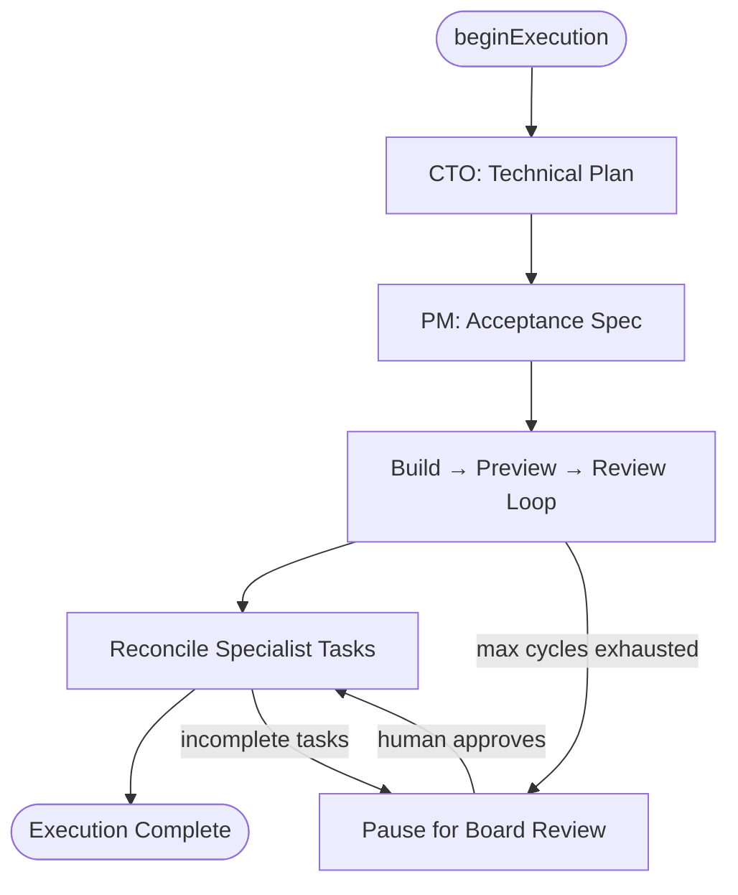
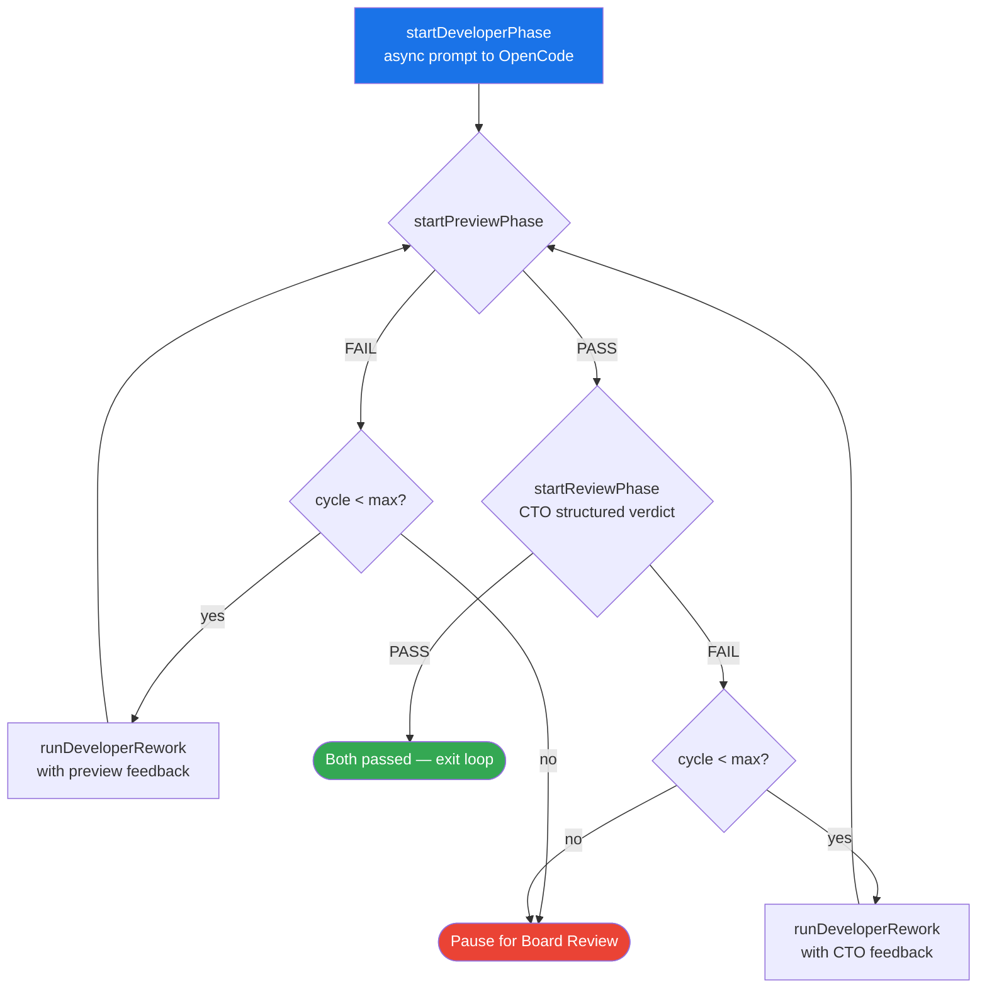
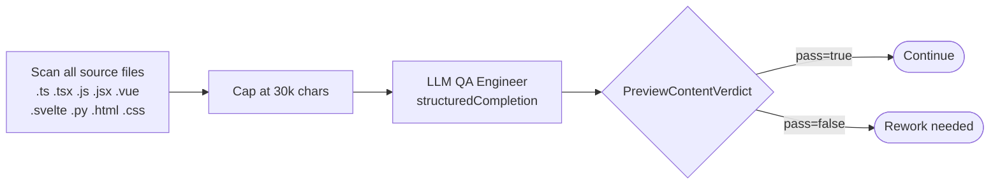
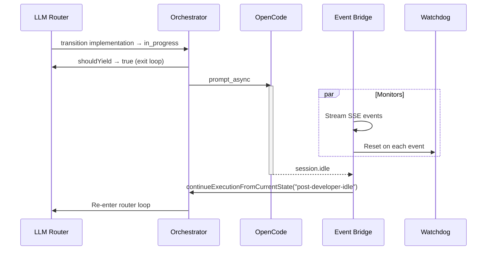
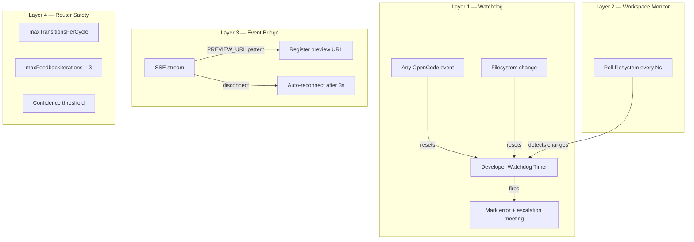
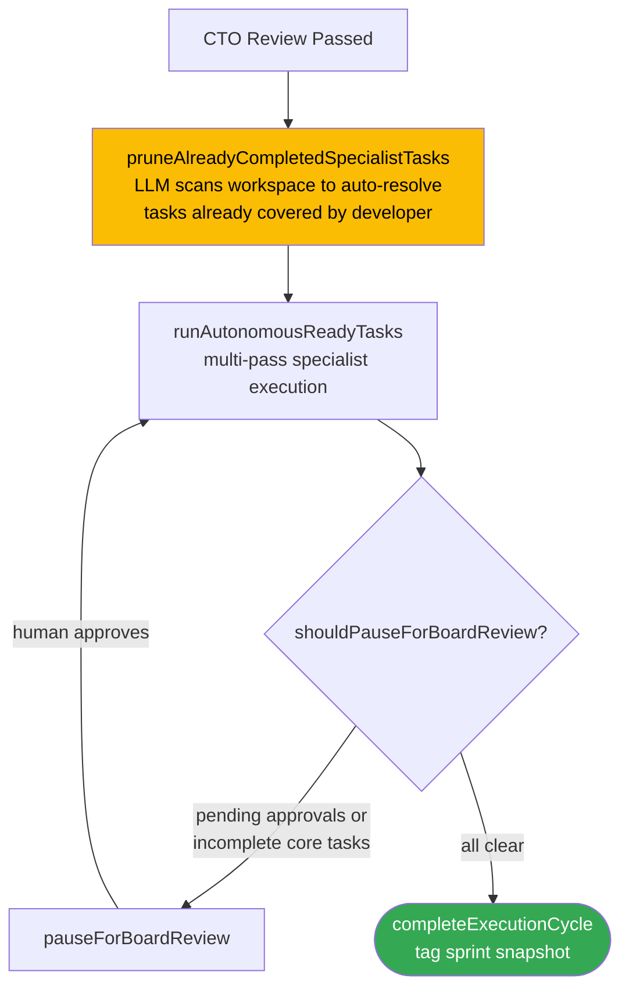
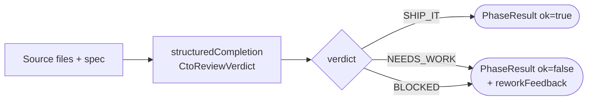
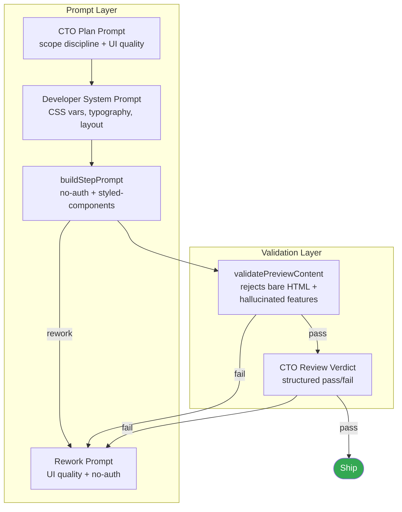
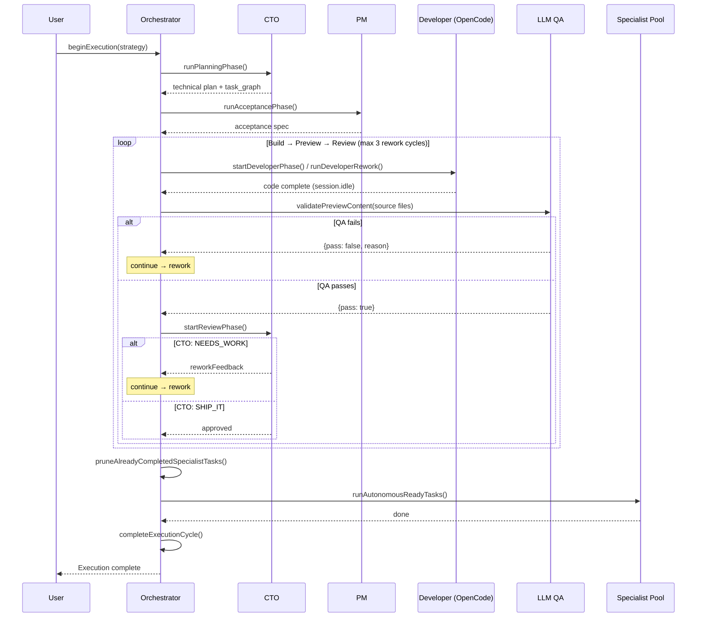

# Orchestration Architecture

## High-Level Flow



Five core tasks are created with a strict dependency chain:

`technical_plan (CTO) → acceptance_spec (PM) → implementation (Developer) → local_preview (Developer) → board_handoff (CTO)`

---

## LLM Router — Dynamic Flow Engine

```mermaid
flowchart LR
    SNAP[Snapshot:<br/>task states +<br/>transitions +<br/>feedback] --> LLM[LLM Router]
    LLM --> PROPS[TransitionProposal[]]
    PROPS --> VAL{Validate}
    VAL -- valid --> EXEC[executeTransitionWork]
    VAL -- invalid --> DROP[Drop + log]
    EXEC --> SNAP
    VAL -- no valid transitions / max reached --> EXIT([Exit loop])
```

**Validation gates:** state machine legality, dependency satisfaction, iteration limits (3), confidence threshold.

---

## Phase Map

| `task.kind` | Function | Agent | Blocking? |
|---|---|---|---|
| `technical_plan` | `runPlanningPhase()` | CTO | Sync |
| `acceptance_spec` | `runAcceptancePhase()` | PM | Sync |
| `implementation` | `startDeveloperPhase()` | Developer | Async (yields) |
| `local_preview` | `startPreviewPhase()` | Developer | Sync |
| `board_handoff` | `startReviewPhase()` | CTO | Sync |
| specialist | `executeSpecialistTask()` | Various | Sync |

---

## Build → Preview → Review Loop (`runBuildPreviewReviewLoop`)

The core execution engine. Owns `developerStepLoopActive` for its entire duration to prevent race conditions with the event bridge.



**Config:** `maxReworkCycles` (default 3) via `ARCEUS_DEVELOPER_MAX_REWORK_CYCLES`.

---

## Preview Validation (`validatePreviewContent`)

Stack-agnostic source-code analysis (no HTML fetching).



**FAIL conditions:**
- Entry point doesn't import product modules
- Only scaffold/boilerplate, no product logic
- Key spec features missing in source
- No meaningful styling (bare unstyled HTML)
- Hallucinated features not in spec (login pages, auth, etc.)

---

## Developer Step Execution with Retry

```mermaid
sequenceDiagram
    participant Loop as Rework Loop
    participant Step as runDeveloperStep
    participant OC as OpenCode
    participant Retry as withRetry (3 attempts)

    Loop->>Retry: runDeveloperStep(prompt)
    Retry->>Step: attempt 1
    Step->>OC: prompt_async
    OC-->>Step: session.idle
    Step-->>Retry: success

    Note over Retry,OC: On "fetch failed"
    Retry->>Step: resetOpencodeConnection()
    Retry->>Step: attempt 2 (backoff 2s→4s→8s)
    Step->>OC: prompt_async
    OC-->>Step: session.idle
    Step-->>Loop: success
```

Both `runDeveloperStep` and `runPromptText` are wrapped in `withRetry` (3 attempts, exponential backoff). On retryable errors (`TypeError: fetch failed`), the OpenCode connection is reset before the next attempt.

---

## Async Developer — Yield & Re-enter



---

## Stall Prevention



---

## Post-Review Reconciliation



**Key:** No follow-up tasks are generated. All specialist work comes from the CTO's `task_graph`. Tasks already implemented by the developer are auto-pruned before specialist execution.

---

## CTO Review Verdict



Structured Zod schema — no free-text parsing.

---

## Scope & Quality Enforcement Points



Five prompt layers + two validation gates ensure UI quality and scope discipline.

---

## End-to-End Sequence


